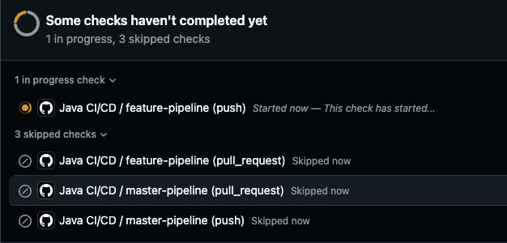
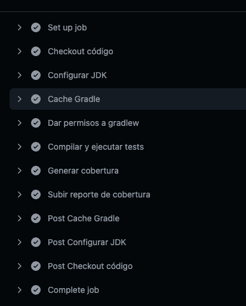
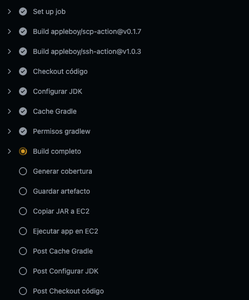

# challenge-serverles-guru
This is a CRUD application for servers guru technical challenge

The app have two pipeline configuration and looks like that: 

For feature branches execute the next steps: 

For master brach execute the next steps: 
